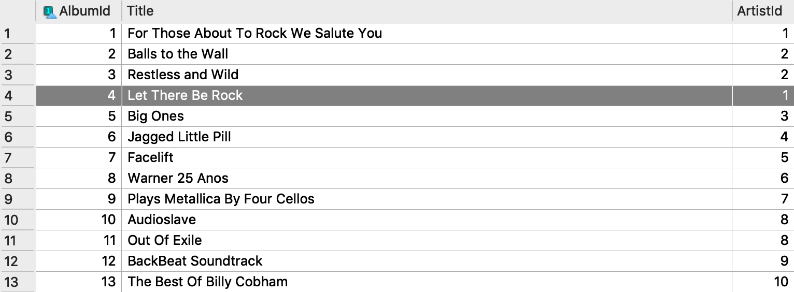
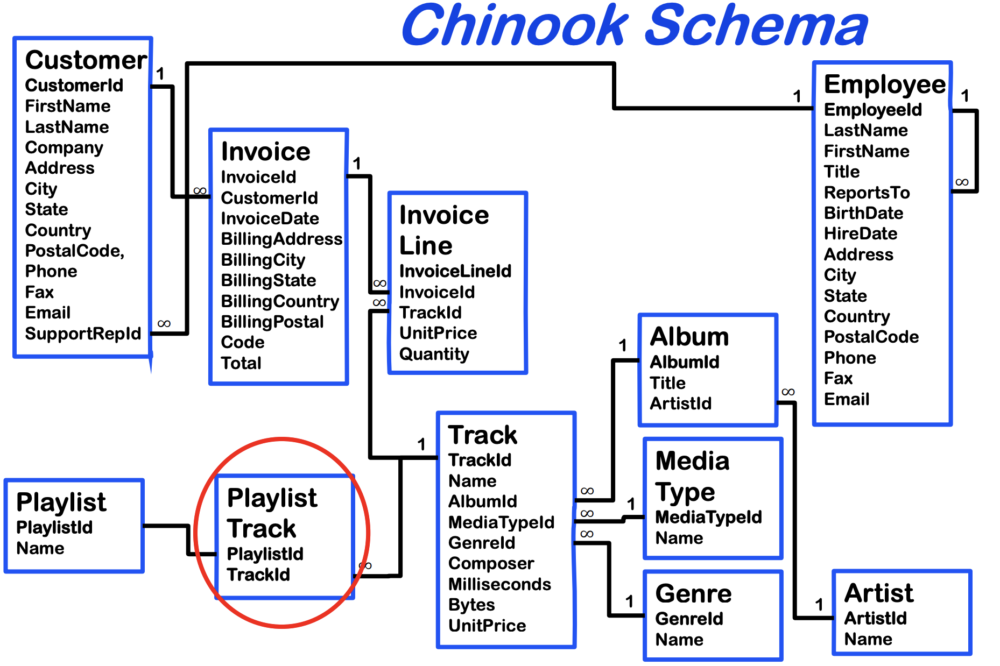

## Relational Database Management System (RDBMS)


(What is the difference between the different SQL languages/schemas?)

## Tables

The **"field view"** of the table 
- each row is a field
- the columns should be the same for all tables


The **"data view"** of the table
- each row is a record.
- each column is a field



**Primary key** - unique for each record. Each album has a unique ID. We need this because two albums can have the same name.

**Foreign key** - a field, or collection of fields, in one table that refers to the PRIMARY KEY in another table.
Notice: ArtistId is a FOREIGN KEY as it is the PRIMARY KEY in the Artist Table

For example, we know that the artist of the the album "Let There Be Rock" has a ArtistId of 1.

Each artist can have many albums, but each album have only one ID. This is a **one-to-many relationship**.

Notice that each relationship is a one-to-many. You need a foreign key and primary key in each relationship.



Each track can appear in multiple playlists, each playlist have multiple tracks. This is a **many-to-many relationships**, we need something. Therefore we need an extra table - **junction/join table** - the Playlist Track table.

PlaylistTrack field view


PlaylistTrack data view


**What is the value of a relational database?**

Consider Track, Album, Artist and Genre. It is possible to have every row in the Track table contain the information on the Album and the Artist, as well as the Genre. However this presents a few problems

- It is a waste of storage space. The Album information than it has now, it needs to repeat for every occurances in the track.
- It is less easy to modify the Album information, because you need to do it for every relevant Track
- (more to be thought of)


## Queries involving one table

By convention, capitalise keywords. SQL keywords are NOT case sensitive: "select" is the same as "SELECT". Identation and extra whitespace does not matter, but it is recommended for readability.

Select all data from a table.

```sql
SELECT * FROM Invoice
```

Select certain columns data from a table.
```sql
SELECT CustomerId, 
       BillingCity, 
       Total 
  FROM Invoice
```

Select rows that fulfil certain conditions from a table.
```sql
SELECT * 
  FROM Invoice 
 WHERE BillingCity = 'London'
```

Produce results with descending order
```sql
  SELECT * 
    FROM Invoice 
   WHERE BillingCity = 'London' 
ORDER BY Total DESC
```

Make operations the column data to calculate a new field.

```sql
SELECT BillingCity, SUM(Total) 
  FROM Invoice 
 WHERE BillingCity = 'London'
```

Specify the name of the new field calculated.

```sql
SELECT BillingCity, SUM(Total) AS CityTotal 
  FROM Invoice 
 WHERE BillingCity = 'London'
```

When you are interested in total amount of bills from each city.

```sql
  SELECT BillingCity, SUM(Total) AS CityTotal 
    FROM Invoice 
GROUP BY BillingCity
```

Make a new table.

```sql
CREATE TABLE RevenueCity AS 
    SELECT BillingCity, SUM(Total) AS CityTotal 
      FROM Invoice
  GROUP BY BillingCity
```

Modify data in the database. **Please only modify new tables.**
```sql
CREATE TABLE RevenueCity AS
    SELECT BillingCity, SUM(Total) AS CityTotal
      FROM Invoice
  GROUP BY BillingCity
```


Use of `CASE WHEN ... THEN ... ELSE ... END`

```sql
SELECT InvoiceId, 
       CustomerId, 
       InvoiceDate, 
       Total, 
       CASE WHEN Total >= 10 THEN "High" ELSE "Low" END AS RevenueClass
  FROM Invoice
```

Use of `DATETIME`

```sql
  SELECT InvoiceId, CustomerId, InvoiceDate from Q030HighRevenue
   WHERE InvoiceDate >= DATETIME("2013-01-01 00:00:00") 
ORDER BY InvoiceDate DESC
```

Use of `IFNULL`

```sql
SELECT *,
       IFNULL(Company, "Missing Name") AS CompanyNew
  FROM Customer
```

(how to replace with the new column, anyway?)


## Queries involving multiple tables

We go through the more advanced SQL with 

**Which albums does the artist named “Queen” owns?**

Select all possible combinations. If Album contains $n$ rows and Artist contains $m$ rows, we are extracting $n \times m$ rows.

```SQL
SELECT * 
  FROM Album, 
       Artist
```

This filters all the combination that fulfils the where condition.

```SQL
SELECT * 
  FROM Album, 
       Artist 
 WHERE Album.ArtistId = Artist.ArtistId
```

The following is equivalent. (Why `ON` instead of `WHERE`? `ON` is used together with `INNER JOIN`)

```SQL
SELECT * 
  FROM Album 
       INNER JOIN 
       Artist ON Album.ArtistId = Artist.ArtistId
```

There are four types of join 
- `INNER JOIN`
- `LEFT JOIN`
- `RIGHT JOIN` (not supported, use `LEFT JOIN`)
-  `FULL OUTER JOIN` (not supported)


Which albums does the artist named “Queen” owns?
```SQL
SELECT *
  FROM Album 
       INNER JOIN 
       Artist ON Album.ArtistId = Artist.ArtistId
 WHERE Artist.Name = "Queen"
```

Show only relevant information.
```SQL
SELECT Album.Title, Artist.Name 
  FROM Album 
       INNER JOIN 
       Artist ON Album.ArtistId = Artist.ArtistId
 WHERE Artist.Name = "Queen"
```

**Which employee serves the most number of customers?**

Extract the relevant information

```SQL
SELECT Employee.FirstName, 
       Employee.LastName, 
       Customer.CustomerId 
  FROM Employee 
       INNER JOIN 
       Customer ON Employee.EmployeeId = Customer.SupportRepId
```

Count the number of customer each employee served and group by employee.
Then order the results in descending order.

```SQL
  SELECT Employee.FirstName, 
         Employee.LastName,
         COUNT(Customer.CustomerId) AS CustomerNo
    FROM Employee INNER JOIN Customer
      ON Employee.EmployeeId = Customer.SupportRepId
GROUP BY Employee.EmployeeId
ORDER BY CustomerNo DESC
```

**Which artist has the greatest sales?**

There are four questions to answer

- The sales of each track

This only involves one table `InvoiceLine`, and multiplies the unit price and quantity to calculate sales.

```SQL
SELECT InvoiceLine.TrackId, 
       InvoiceLine.UnitPrice * InvoiceLine.Quantity AS TrackSales
  FROM InvoiceLine
```

- The sales of each track in each album

This involves the `INNER JOIN` two tables `InvoiceLine` and `Track` based on `TrackID`.

```SQL
SELECT InvoiceLine.TrackId,
       Track.AlbumId,
       InvoiceLine.UnitPrice * InvoiceLine.Quantity AS TrackSales
  FROM InvoiceLine
       INNER JOIN
       Track ON InvoiceLine.TrackId = Track.TrackId;
```

- The sales of each track of each artist
```SQL
SELECT Artist.Name,
       InvoiceLine.UnitPrice * InvoiceLine.Quantity AS TrackSales
  FROM (
           (
               InvoiceLine
               INNER JOIN
               Track ON InvoiceLine.TrackId = Track.TrackId
           )
           INNER JOIN
           Album ON Track.AlbumId = Album.AlbumId
       )
       INNER JOIN
       Artist ON Album.ArtistId = Artist.ArtistId;
```

- The total sales of each artist

Use `SUM` together with `GROUP BY` to the total ArtistSales

```SQL
SELECT Artist.Name,
       SUM(InvoiceLine.UnitPrice * InvoiceLine.Quantity) AS ArtistSales
  FROM (
           (
               InvoiceLine
               INNER JOIN
               Track ON InvoiceLine.TrackId = Track.TrackId
           )
           INNER JOIN
           Album ON Track.AlbumId = Album.AlbumId
       )
       INNER JOIN
       Artist ON Album.ArtistId = Artist.ArtistId
 GROUP BY Artist.Name
 ORDER BY ArtistSales DESC;
```


**What is the most popular genre of music in Texas?**

Can be done, please try.

**Which invoice caused the most number of customer support calls**

Not possible because no information. (Is it possible for the reason to be due to how the database is structured?)


## SQLiteStudio - Troubleshooting

Nothing appears when loaded
- View > Check "Databases"
