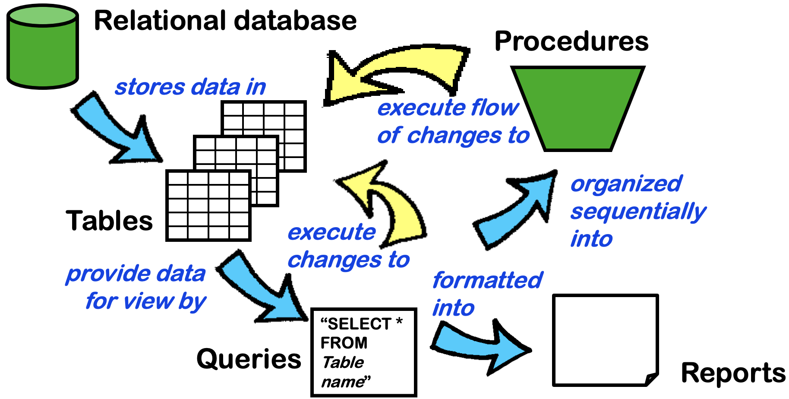

## Relational Database Management System (RDBMS)




## Tables

The **"field view"** of the table 
- each row is a field
- the columns should be the same for all tables


The **"data view"** of the table
- each row is a record.
- each column is a field


**Primary key** - unique for each record. Each album has a unique ID. We need this because two albums can have the same name.

**Foreign key** - a field, or collection of fields, in one table that refers to the PRIMARY KEY in another table.
Notice: ArtistId is a FOREIGN KEY as it is the PRIMARY KEY in the Artist Table

For example, we know that the artist of the the album "Let There Be Rock" has a ArtistId of 1.


Each artist can have many albums, but each album have only one ID. This is a **one-to-many relationship**.

Notice that each relationship is a one-to-many. You need a foreign key and primary key in each relationship.


Each track can appear in multiple playlists, each playlist have multiple tracks. This is a **many-to-many relationships**, we need something. Therefore we need an extra table - **junction/join table** - the Playlist Track table.

PlaylistTrack field view


PlaylistTrack data view


## Queries

By convention, capitalise keywords. SQL keywords are NOT case sensitive: "select" is the same as "SELECT". Identation and extra whitespace does not matter.


"Non-procedural: does not describe HOW to get data (looping, testing)"


Prescribed syntax: "KEYWORD expression KEYWORD expression ... etc". Not really always - "SELECT AS"


Select all data from a table.

```sql
SELECT * FROM Invoice
```

Select certain columns data from a table.
```sql
SELECT CustomerId, 
       BillingCity, 
       Total 
  FROM Invoice
```

Select rows that fulfil certain conditions from a table.
```sql
SELECT * 
  FROM Invoice 
 WHERE BillingCity = 'London'
```

Produce results with descending order
```sql
  SELECT * 
    FROM Invoice 
   WHERE BillingCity = ‘London’ 
ORDER BY Total DESC
```

Make operations the column data to calculate a new field.

```sql
SELECT BillingCity, SUM(Total) 
  FROM Invoice 
 WHERE BillingCity = 'London'
```

Specify the name of the new field calculated.

```sql
SELECT BillingCity, SUM(Total) AS CityTotal 
  FROM Invoice 
 WHERE BillingCity = 'London'
```

When you are interested in total amount of bills from each city.

```sql
  SELECT BillingCity, SUM(Total) AS CityTotal 
    FROM Invoice 
GROUP BY BillingCity
```

Make a new table.

```sql
CREATE TABLE RevenueCity AS 
    SELECT BillingCity, SUM(Total) AS CityTotal 
      FROM Invoice 
  GROUP BY BillingCity
```

Modify data in the database. **Please only modify new tables.**
```sql
CREATE TABLE RevenueCity AS 
    SELECT BillingCity, SUM(Total) AS CityTotal 
      FROM Invoice 
  GROUP BY BillingCity
```