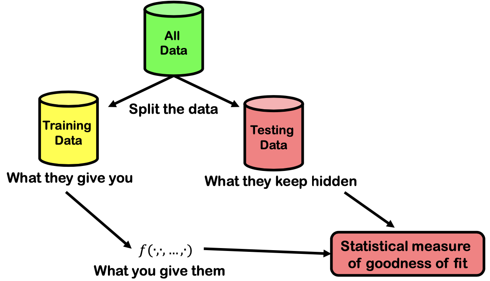

# Statistics

(This is more of a revision, I am taking only some more important points.)

Objective of minimise least squares (sum of squared errors)

$$
SSE 
= \Sigma_{i=1}^n \epsilon_i^2 
= \Sigma_{i=1}^n (y_i - \hat{y}_i)^2
$$

Coefficient of determination (R-squared).

$$
R^2 = 1 - \frac{SSE}{SST}
$$

A function $f$ should be **parsimonious**: it should fit the data well using as few explanatory variables as possible.

**Adjusted R-squared**
$$
R_{adj}^2 = R^2 
            - \left(\frac{p}{n-p-1}\right)(1-R^2)
$$
Residuals plot - should be idependently and randomly distributed.

Linear functions

This can be be a linear function

$$
f(x_1,x_2, ... ,x_p) 
= \beta_0 
  + \beta_1 x_1^2 
  + \beta_2 x_1 x_2 
  + ... 
  + \beta_4 e^{x^4}
$$

This is not a linear function

$$
f(x_1, x_2)
= e^{\beta_0 + \beta_1 x_1}
$$

This is a probability model
$$
y = \beta_0 
  + \beta_1 x_1^2 
  + \beta_2 x_1 x_2 
  + ... 
  + \beta_4 e^{x^4}
  + \epsilon_i
$$

