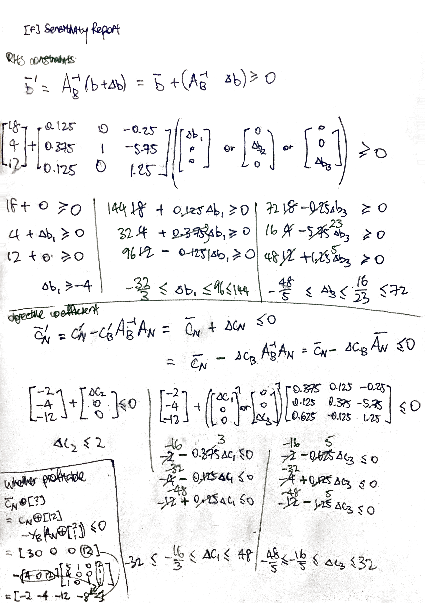
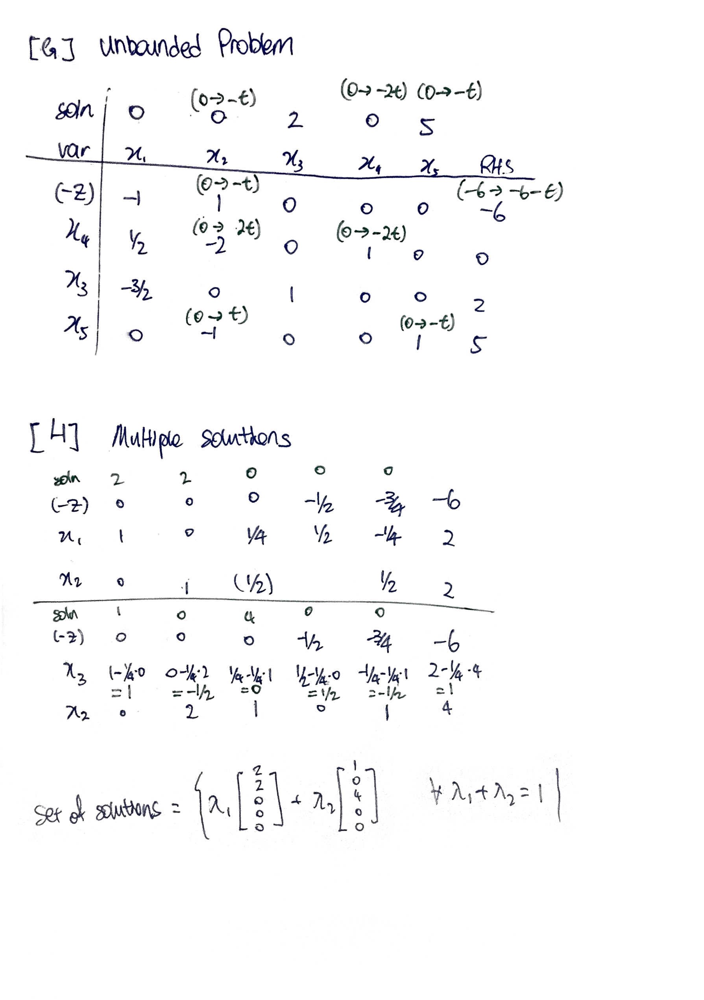
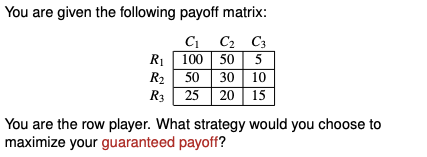

# Midterms revision notes

Procedure of solving a problem with linear programming.

**1) Transform the problem into a linear program.**

- This is a step highly dependent on the circumstances. Some examples are given in - **[A]** converting linear residuals into a linear program.

**2) Transform the linear program into a standard linear program.**

- This can always be done, by adding slack variables **[B]**.

**3) Ensure the standard linear program has linearly independent rows.**

- If the rows are not linearly independent, there are redundant constraints. You may remove them.

**4) Obtain a canonical form of the linear program.**

- Simplex I algorithm **[C]**. This can always be done unless there is no feasible solution.

**5) Obtain the optimal solution of the linear program.**

- Simplex II algorithm **[D]**. You might have many solutions - then you need to present all of them.

**6) Conduct sensitivity analysis and consider edge cases.**

- Interpret the matrices **[E]**, and calculate the allowable change **[F]**.
- Consider edge cases as well **[G]** and multiple solutions **[H]**

**Remainder of the course**

- **[I]** Dual problems
- **[J]** Games
- **[K]** Graphs

## [0] Definitions

"**General**" linear program (one if the objective function is linear and the constraints are linear equalities or inequalities). 
$$
\begin{align*}
max/min &\quad \vec{c}^T\vec{x} \\
s.t. &\quad \vec{a}_i^T\vec{x} \enspace \geq / =/\leq \enspace b_i \quad \forall i \\
\end{align*}
$$
Note that all inequalities **<u>are non-strict.</u>** Please transform all strict inequalities to non-strict inequalities.

**Standard** form of a linear program
$$
\begin{align*}
max \quad \vec{c}^T \vec{x} \\
s.t. \quad A\vec{x} &= \vec{b} \geq \vec{0} \\
\vec{x} &\geq 0
\end{align*}
$$
**Canonical** form of a linear program - variables and constraints of $x$ can permuted to represented in this way
$$
\begin{array}{r@{}cl}
max \quad c_N x_N  &+k \\
\quad x_B + A_N x_N &=& b \\
\quad x_B, x_N &\geq& 0
\end{array}
$$

One basic feasible solution can be read off the canonical form, with $x_b = b$  and $x_N = 0$, with the objective value equal to $k$.

If $c_N$ is nonnegative, the basic feasible solution is an optimal solution.

## [A] Converting linear residuals into a linear program

Please note that a linear program **does not allow strict inequalities**.

**Least squares - cannot be converted into a linear program.**

This includes the least-squares best-fit line.

**Converting linear absolute residuals into a linear program.** 

The problem: Minimize $\Sigma_{i=1}^6 |\epsilon_i|$, where $\epsilon$ is a linear expression of decision variables (in this case, the intercept and slope of two variables).

**Solution 1**
Minimise $\Sigma_{i=1}^6 r_i^-, + r_i^+$

where 
$$
\epsilon = r_i^- - r_i^+
$$
with
$$
r_i^-, r_i^+ \geq 0
$$

(The optimal solution will minimise such that $r_i^-$ and/or $r_i^+$ is zero.)

**Solution 2**
Minimise $\Sigma_{i=1}^6 z_i$
with 
$$
\begin{align}
\epsilon_i &\leq z_i \\
-\epsilon_i &\leq z_i
\end{align}
$$

(I still don't understand how this works.)

**Converting maximum absolute residual into a linear program**.

The problem: Minimize $max(|\epsilon_i| \enspace \forall i)$

**Solution**

Minimise $r$. 

For all $i$,
$$
\begin{align}
r &\geq \epsilon_i \\
r &\geq -\epsilon_i
\end{align}
$$

From the slides (notice that $\epsilon_i$ is an expression).

The linear program finds the optimal values of $b_0$, $b_1$, $b_2$ and $r$(s) that optimises the objective function. $L_i$, $P_i$ and $E_i$ are constants given by the data.

 
## [B] Converting a linear program into a standard linear program

**All linear programs can be transformed into a standard linear program.** Here are the steps.

- If the objective function is to minimise, filp all the coefficients $\vec{c}$ to get a maximising objective function instead.

- If the constant of the equality or inequality is negative - please flip all the cofficients of the inequality:

  $$a_1 x_1 + ... a_n x_n \leq b < 0 \enspace \rarr \enspace -a_1 x_1 ... - a_n x_n \geq b' > 0$$

- If the condition is a $\geq$ inequality, for the inequality add a nonnegative slack variable:

  $$a_1 x_1 + ... a_n x_n \geq b \enspace \rarr \enspace a_1 x_1 ... + a_n x_n + s_g = b \enspace \text{and} \enspace s_g \geq 0$$

- If the condition is a $\leq$ inequality, for the inequality add a nonnegative slack variable:

  $$a_1 x_1 + ... a_n x_n \leq b \enspace \rarr \enspace a_1 x_1 ... + a_n x_n - s_l = b \enspace \text{and} \enspace s_l \geq 0$$

- If there are free variables like $x_f$, you have to create **two** slack variables which are greater-or-equal-to zero

  $$x_f \rarr x_f^+ - x_f^-$$ for all appearance of $x_f$ in the all the equality constraints and objective function
  Also, add the inequality $x_f^+, x_f^- \geq 0$

 
## [C] Simplex Phase I

**PHASE I** - Transforming the **standard form** to the **canonical form**
$$
max\left\{ cx | A\vec{x} = \vec{b} \geq \vec{0}, \vec{x} \geq 0 \right\}
$$
$A$ is made up of $n$ linearly independent rows.

First, we add nonnegative $n$ **slack** variables to create a **<u>different</u> LP problem** with a different objective function. 

- We can add less than $n$ if there are variables that can serve as basis variables). 

Begin with a canonical form of the new LP problem by managing the objective function. Carry out the Simplex Phase II iteration. Results:

- The Phase I objective function value is nonzero: the initial problem has **no feasible solution**. We can stop.
- The Phase I objective function value is zero and no artificial variable is in the basis: **we have a basic feasible solution** for the initial problem. Proceed.
- The Phase I objective function value is zero and some artificial variables are in the basis.
  - We try to pivot them out (there may be many solutions).
  - If we cannot, then **there are redundant constraints** that we can drop. After this, we drop the artificial variables to obtain the initial simplex tableau for Phase II. (Is it possible to have no feasible solutions?)
    - This will not happen if the rows of $A$ were linearly independent.

Remove the slack variables, and continue Phase II with the original objective function from the standard form.

 
## [D] Simplex Phase II

**PHASE II** - Obtaining the **optimal solution** from the **canonical form**

We start with the **canonical form**.

- You can read off a **basic feasible solution **(BFS). 
  - The non-basis variables are zero
  - The basis variables is equal to the RHS.
  - The objective value is the RHS of $z$.

We choose an **entering basis variable** (which is currently a non-basis variable).

- the non-basis variable has **positive reduced cost** (all basis variables have zero reduced cost)
- if there are multiple non-basis variables, choose the variable the **smallest index** (Bland's rule 1)

We also choose an **leaving basis variable** (which will be a non-basis variable).

- constraint coefficient of the nonbasic variable is **nonnegative** 
- among those above, choose the variable with the **smallest ratio** (of RHS over constraint coefficients)
  - The ratio will definitely be nonnegative. (QUESTION: what if the smallest is infinite?) 
  - Intuition - if you do not use a minimum ratio, you will end up with a negative RHS, the form is no longer canonical and a BFS cannot be read off.
- if the ratio is a tie, choose the variable will a **smaller index** (Bland's rule 2 - Bland's rules help to prevent cycling, it does not change the problem and prevent degeneracy.)

Then we pivot the basis variables. The LP problem should remain the same, and still in canonical form after every pivot. Then we iterate until we reach either one of the following conditions 

- All non-basis variable have **negative** reduced costs: the current basic feasible solution is **the** optimal. We can stop.
- All non-basis variables have **nonpositive** reduced costs, the current basic feasible solution is **an** optimal. We may stop.
  - We may pivot to obtain other optimal basic feasible solutions.
  - To obtain the set of optimal solutions, take the convex combination of optimal basic feasible solutions.
    - $\lambda_1 v_1 + \lambda_2 v_2 + ... \quad \forall \enspace  \lambda_1 + \lambda_2 + ... = 1$
- There exists one non-basis variable with **positive** reduced cost that appears with **all nonpositive coefficients** in the constraints: the problem is unbounded, we can stop.
  - You can increase the non-basis variable indefinitely while satisfying the constraint.
    - For each constraint - as the non-basis variable increase, the corresponding decrease of its term in the constraint LHS can be balanced by increasing the value of the basis variable.

 
## [E] Interpretation of matrices

## [F] Calculate allowable change

## [G] Consider edge cases

 
# [I] Dual problem 

**Definitions**

Given an "primal" LP (expressed in this form)

$$
\begin{align}
max \enspace c^T x& \\
Ax& \leqslant b \\
x& \geqslant 0
\end{align}
$$

we can formulate a dual LP 

$$
\begin{align}
min \enspace b^T y& \\
A^{T} y& \geqslant c \\
y& \geqslant 0
\end{align}
$$

The dual of the dual is the primal. (You need to express the dual form into a primal before you can calculate the dual of the dual.)

**Complementary Slackness property**

Let $\bar{x}$ and $\bar{y}$ be feasible solutions to the primal and dual problem, respectively. $\bar{x}$ and $\bar{y}$ are optimal solutions for the two respective problems if and only if:

$$
\begin{align}
\bar{y}_i (b_i - a_i^T \bar{x}) &= 0, 
\enspace \forall i, \quad \text{and} \\
(A_j^T \bar{y}_i - c_j) \bar{x}_j &= 0, 
\enspace \forall i
\end{align}
$$

[QUESTION] Do they imply one another?

In an optimal solution

- either $10x_1 + 5x_2 + 2x_3 = b_1$ (which is 204) or $y_1 = 0$ (which is 4)
- either $5y_1 + 4y_2 + y_3 = c_j$ (which is 30) or $x_2 = 0$ (which is zero)

This applies for all constraint-solution pair, and solution-constraint pair.

 
**Weak Duality Theorem**

Condition
- $\bar{x}$ is a feasible solution to the primal 
- $\bar{y}$ is a feasible solution to the dual

Result
- $c^{T} \bar{x} \leq b^{T} \bar{y}$.

One of the intuitions - Suppose that $x^{*}$ is optimal to the primal, then $x^{*}$ is feasible to the relaxation.

**Strong Duality Theoerm**

Condition
- If a primal problem has an optimal solution.

Result
- The dual problem has an optimal solution.
- The respective objective function values are equal.

**Fundamental Theorem of Linear Programming**

For a pair of primal problem P and dual problem D, exactly one of the following is true

- P and D have optimal solutions and their objective function values are equal
- P is unbounded and D is infesaible
- D is unbounded and P is infeasible
- Both problems are infeasible.

 
**Formulating the dual of a general LP**

**Economic interpretation**

Please try to understand this.

Please also understand the optional component in W4L2 on restoring feasibility after adding a constraint.

 
# [J] Games

**Two-player zero-sum game**

**Guaranteed payoff**

To maximise guaranteed payoff, row player would play row 3.

**Dominating strategies**

**Saddle point**

When the game only have one outcome each player would not choose any other outcome.

[QUESTION] Is the saddle point always an intersection of dominating strategies?

**Mixed strategy** 

Made up of a set of probailities. The row player can play different rows with a probability that does not change.
Objective - to **maximise guaranteed payoff**.
Intuition - the opponent will detect the strategy, and the guaranteed payoff will converge.

Solution: $$
p_1 = 7/18, \enspace 
p_2 = 5/8, \enspace 
p_3 = 1/3, \enspace
z = 1/9$$

 
**The linear programming problem for row player**

Objective: maximise guaranteed payoff of the row player

$$
\begin{align}
\max \min\{E(C_1), E(C_2), E(C_3)\}&  \\
p_1 + p_2 + p_3 &= 1 \\
p_1, p_2, p_3 &\geq 0
\end{align}
$$

where
$$
\begin{alignat*}{4}
E(C_1) & {}={} &-2p_1 & {}+{} &2p_2 &{}+{} &p_3 \\
E(C_2) & {}={} &  p_1 & {}-{} & p_2 &{} {}       \\
E(C_3) & {}={} & 2p_1 & {} {} &     &{}-{} &2p_3
\end{alignat*}
$$

Formulating as a linear programming problem
$$
\begin{align}
\max z& \\
E(C_1) &\geq z\\
E(C_2) &\geq z\\
E(C_2) &\geq z\\
p_1 + p_2 + p_3 &= 1 \\
p_1, p_2, p_3 &\geq 0 
\end{align}
$$

(This is a relaxation because they are not exactly equivalent, because $z$ could be any value besides $E(C_1), E(C_2), E(C_3)$)

**The linear programming problem for column player**

Objective: minimise the guaranteed payoff of column player
$$
\begin{align}
\min \max\{E(R_1),E(R_2),E(R_3)\} \\ 
q_1 + q_2 + q_3 &= 1 \\
q_1, q_2, q_3 &\geq 0
\end{align}
$$

where

$$
\begin{alignat*}{4}
E(R_1) & {}={} &-2q_1 & {}+{} &q_2 &{}+{} &2q_3 \\
E(R_2) & {}={} & 2q_1 & {}-{} &q_2 &{} {}       \\
E(R_3) & {}={} & 2q_1 & {} {} &    &{}-{} &2q_3
\end{alignat*}
$$

Formulating as a linear programming problem
$$
\begin{align}\min v& \\
E(R_1) &\leq v\\
E(R_2) &\leq v\\
E(R_2) &\leq v\\
q_1 + q_2 + q_3 &= 1 \\
q_1, q_2, q_3 &\geq 0 \end{align}
$$

This is a primal-dual pair. ([TODO] To show)

 
**Graphical solution to small games**

If there are only two strategies available, you can use one variable $\{p, 1-p\}$ and you do not need to use an LP to solve the problem.

You can use a graphical solution. The maximum is a piecewise function with a maxima at (0.375, -0.125).

[TODO] Explain for the column player as well.

**Formulating games as LP problems**

Each player can decide on a combination of decisions **before** the games commence. (Example from cohort - combinations of decisions of whether to pass or bet on head and tails). The strategy is to assign a probability to each combination.

 
# [K] Graphs

**Directed graph and undirected graph**

Differences between directed graph and undirected graph

| Property         | Undirected Graph   | Directed Graph            |
| ---------------- | ------------------ | ------------------------- |
| Edges of nodes   | Degree             | Indegree, Outdegree       |
| Adjacency Matrix | Symmetric          | Not necessarily symmetric |
| Incident Matrix  | Columns sum to two | Columns sum to zero       |

**Terminologies**

- Path - a sequence of arcs that connect a sequence of vertices with no repetitions
- Circuit/cycle - a path but the first and last node that is the same
- Walk - a sequence of arcs that connect a sequence of vertices, possibly with repetitions
- Eulerian path - a walk that passes through each arc exactly once
- Eulerian cycle - a walk that passes through each arc exactly once and ends at the starting node

**Special graphs**

- connected graph - at least one back between every pair of nodes
- tree - all nodes have exactly one indegree, except one

**Theorems**

- A graph has a Eulerian path if and only if it is connected and it has exactly two nodes of odd degree
- A graph has a Eulerian cycle if and only if it is connected and all nodes have even degree

 
**Shortest path problem**

The shortest path tree stores all shortest path from the starting node.

Three set of variables 
- Heap of nodes to visit next
- For each node - distance from starting
- For each node - the previous node 

**Key steps of Dijkstra's algorithm**

- Initialise infinite distance for all nodes except the starting one
- Consider the node from the heap with minimum distance from starting (this is the "considered node")
- For each "adajcent node" to the considered node (visited or not), calculate the distance
- If the distance is smaller (the new path is shorter)
  - If the distance had been infinite (the adjcaente never visited before)
     - Add the node to the heap
  - Update distance and previous node of the adajcent node
- Remove the considered node from the list.

 
**Workings of Dijkstra's algorithm**

