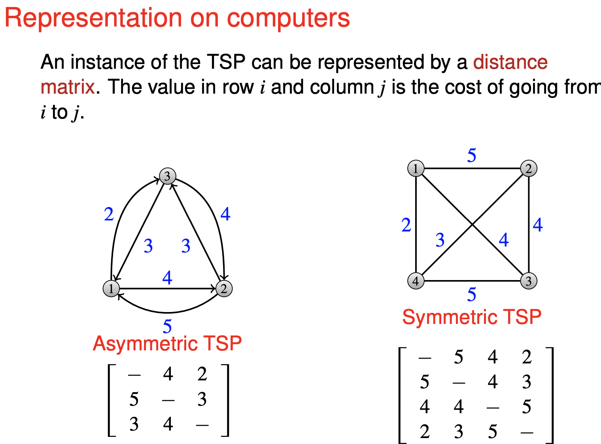
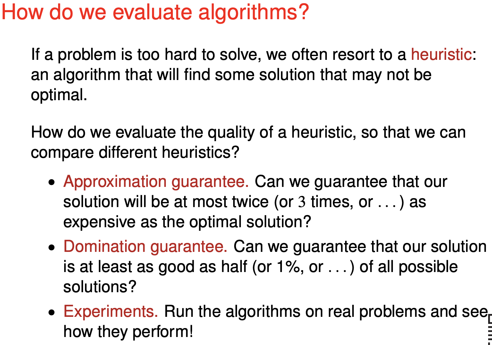

# Travelling salesman problem

Notes

- Open to obtaining graduate school letters
- Invitation to the advanced optimisation course
- Selin's school email will no longer be available.

**Subtour elimination**

To eliminate all subtours you need $2^n$ constaints. At some $n$ you cannot even insert the constraints into your computer.

Improvement - solve without the subtour constraint initially. When the solution contains a subtour, add the subtour into the constraint and solve again. You might need to do this many times. Nevertheless each solution provides a lower bound to the solution. (Any feasible solution provides an upper bound to the problem.)

**Dynamic programming for TSP**

Assume that we know the best tour from one node to another, excluding certain nodes. This can be the basis for iteration.

We say that subtour $T$ **dominates** T 1 if: 

1. $T$ and $T'$ begin at 1 and end at the same city $j$. 
2. The length of $T$ is at most the length of $T'$ . 
3. $T$ and $T'$ visit the same set of cities.

**Heuristic approaches**

"k-approximation algorithm" at most k times worse than the optimum.

"domination number D" at least as good as D of the possible solutions.

## Nearest Neighbour

Start from any node - this is random. (You can try all of them.) From then on the algorithm is deterministic.

Always go to the node with smallest distance to the current node and that has not been previously visited. After visiting all nodes, go back to the starting node.

Not guarantees, could be the worst. But some guarantees is possible if triangle inequality is satisfied.

## Insertion Algorithm

From 4-node subtour to a 5-node subtour. The order of nodes to insert is randomly chosen.

Produces a tour $(n-2)!$ out of the $(n-1)!$ possible tours.

## Christofiedes Algorithm

Start with the minimum spanning tree. Then do magic.

Assume triangle inequality. May produce the worst possible tour, but has an approximation gurantee of 2 (one the first to have).

(Triangle inequality do not hold in real life, however. A direct path may be shorter than a detour.)

## Local search algorithms 

This improves a current solution.

Any solution that has done through the 2-Opt is at least better than $(n-2)!$ out of $(n-1)!$ tours.

This algorithm makes it harder for observers to point out an easier solution visually.

