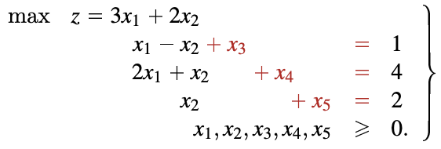
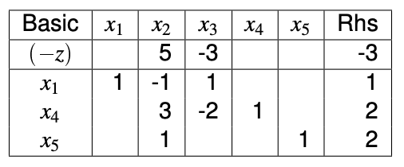
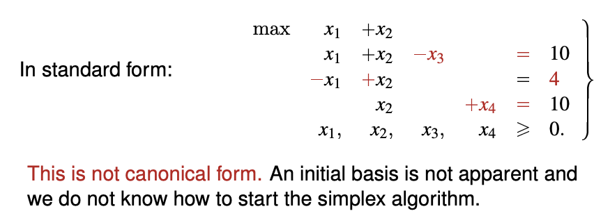
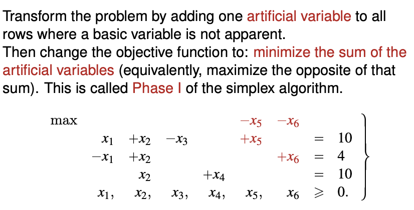

# Simplex Algorithm

There are two phases of the simplex algorithm.
- transforming the standard form to the canonical form
  - First provide nonnegative artificial variables change . 
  - Then we minimise the non-
- obtaining the optimal solution from the canonical form
  - We change one basis variable at a time.

## Canonical form of a linear program

Here we elaborate on the conditions for a Linear Program to be considered a canonical form.

All linear programs that can be represented as a canonical form has a solution.

1) It is in standard form
$$
\begin{align*}
max \quad \vec{c}^T \vec{x} \\
s.t. \quad A\vec{x} &= \vec{b} \geq \vec{0} \\
\vec{x} &\geq 0
\end{align*}
$$

2) The constraint matrix (of size $m \times n$) contains (a permutation of) the identity matrix as a submatrix (of size $n \times n$). 

A **permutation** of a identity matrix refers to a square matrix that can form the identity matrix by rearrangings its rows (or columns, the same).
$$
\begin{bmatrix}
    1 & 0 & 0 \\
    0 & 1 & 0 \\
    0 & 0 & 1
\end{bmatrix},
\begin{bmatrix}
    0 & 0 & 1 \\
    0 & 1 & 0 \\
    1 & 0 & 0
\end{bmatrix},
\begin{bmatrix}
    0 & 1 & 0 \\
    1 & 0 & 0 \\
    0 & 0 & 1
\end{bmatrix},
\begin{bmatrix}
    1 & 0 & 0 \\
    0 & 1 & 0 \\
    0 & 0 & 1
\end{bmatrix}
$$

You can see that the following matrices contains a permutation of the indentity matrix as a submatrix.

$$
A = 
\begin{bmatrix}
    0 &  1 &  1 &  0 \\
    1 & -3 &  0 &  1
\end{bmatrix}
$$

$$
A =
\begin{bmatrix}
    0 &  -4 &  1 &  0 \\
    1 &   1 &  0 &  0 \\
    0 &  -7 &  0 &  1 \\
\end{bmatrix}
$$

3) The variables with a "+1" coefficient in the identity matrix appear **with a zero coefficient** in the objective function.

You see that objective function is independent of the variables in the objective function. 

# Phase II of Simplex Algorithm

We assume that we have obtained the canonical form of a linear program. Now we solve for the second phase.

I am representing the equation with the table form.

You can read off a **basic feasible solution** here. One that has $x_1$ and $x_2$ that is equal to zero. However, this is not the optimal solution.

Now we swtich the basic variable until the coefficient of the objective function (reduced cost) is all nonpositive (?).

Firstly, should we replace basis variable  $x_1$ with $x_3$ or $x_4$?

We use **the ratio test**. When improving a given canonical form by introducing variable $x_s$ into the basis

- pivot in a constraint that gives the **minimum ratio** of righthand-side coefficient to corresponding $x_s$ coefficient.
- Compute these ratios only for constraints that have a **positive coefficient** for $x_s$

Ratio for $x_4$ is $\frac{4}{1} = 4$, ratio for $x_2$ is $\frac{2}{1} = 2$.
Ratio for $x_3$ not considered because coefficient of x_3 is negative.

We have thus chosen $x_4$ to replace $x_3$ as the basis variable.

This is still a canonical form.

Do until the reduced cost is zero.

This is the completed solution.

| 0.00 | 0.00 | 0.00 | -1.50 | -0.50 | -6.67 |
| ---- | ---- | ---- | ----- | ----- | ----- |
| 1.00 | 0.00 | 0.00 | 0.50  | -0.50 | 1.33  |
| 0.00 | 1.00 | 0.00 | 0.00  | 1.00  | 1.33  |
| 0.00 | 0.00 | 0.00 | 0.00  | 0.00  | 0.67  |

## Bad cases for Phase I

Unbounded case. 

In essense you can increase x_4 and RHS infinitely.

Degenerate case.
How about parallel case? Anywhere along an edge of the boundary it is optimum. This will cycle. Will use simple method to stop this cycling.

Consider a maximization LP in canonical form. Then we are in
one of the following cases:

- All variables have nonpositive reduced costs: the current basic feasible solution is optimal, we can stop.
- There exists one variable with positive reduced cost that appears with all nonpositive coefficients in the constraints: the problem is unbounded, we can stop.
- All variables with positive reduced cost appear with at least one positive coefficient in the constraints: the current basic feasible solution can be improved, we perform a pivot to change the basis.

If there are $m$ constraints and $n$ variables, there are $^mC_n$ bases.

## Phase I of Simplex algorithm

Given a standard form, obtain a canonical form.

Firstly, add artifical variables. (We do not need to add $x_7$ because the $x_4$ provided can be part of the matrix already.)

**The objective function is changed.**

Simple substituiton to obtain this.

Conduct Phase II Simplex algorithm to obtain the following result.

The new variables $x_5$ and $x_6$ can be eliminated, because we know that they are zero.

## Bad Cases for Phase II

At the end of Phase I, we are in one of the following cases:
- The Phase I objective function value is nonzero: the initial problem has **no feasible solution**. We can stop. 
- The Phase I objective function value is zero and no artificial variable is in the basis: **we have a BFS** for the initial problem. We drop the artificial variables to obtain the initial simplex tableau for Phase II. 
- The Phase I objective function value is zero and some artificial variables are in the basis: we pivot them out, if we cannot, then **there are redundant constraints** that we can drop. After this, we drop the artificial variables to obtain the initial simplex tableau for Phase II.