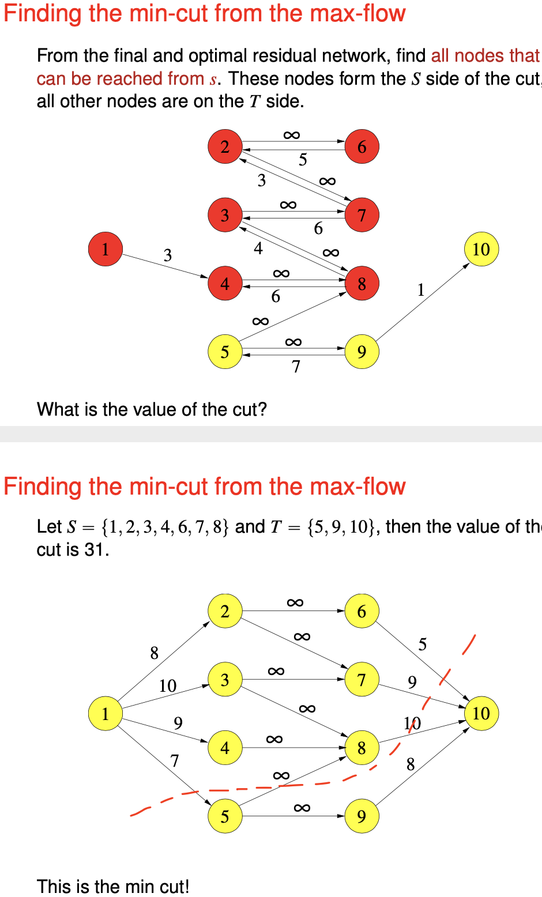
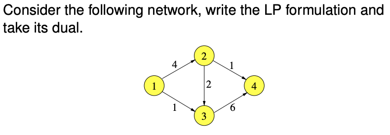
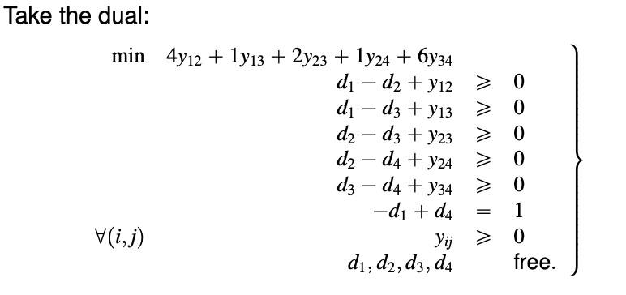
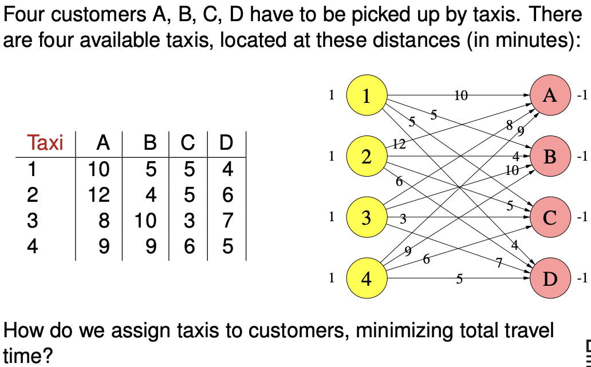
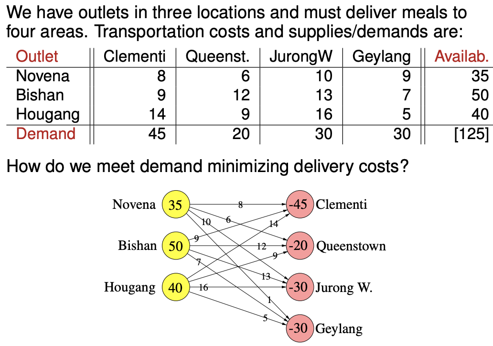
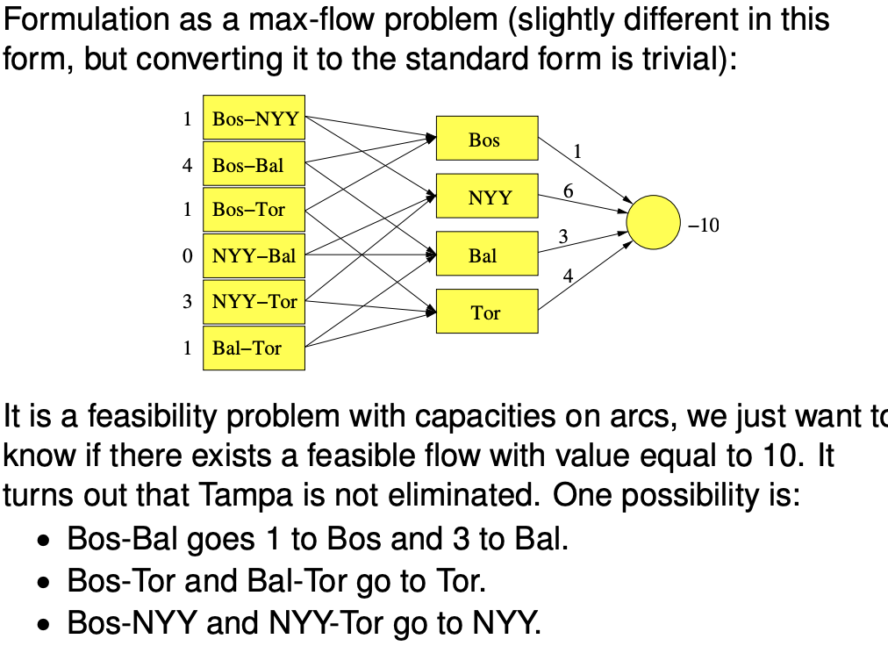

# Max-flow problem

### **Taxonomy of network problems**

- **Linear programming (Simplex)**
- **Min-cost flow problem (Network Simplex)**
  - **Max-flow problem (Ford-Fulkerson)**
  - Baseball elimination (example)
    (Only have four layers, attempts to exhaust all supply)
  
  - Maximum cardinality matching

    - Transhipment problem
      How to meet the demand while minimising delivery costs?
    - Transportation problem
          (Transhipment problem without intermediate nodes)
        - Assignment problem
              (The total demand is equal to total supply)
    
        - **Shortest path problem (Dijkstra)**
        (You are transferring a unit supply from the source to the tap at minimum cost)

### The max-flow problem

Given a directed network $G = (V,E)$ and a source node $s$, a sink node $t$, and a possibly infinite capacity $u_{ij}$ for each arc $(i,j)$

The max-flow problem is the problem of finding a value of flow for every arc in such a way that

- Flows are nonnegative and arc capacities are satisified
- For every node that is not $s$ or $t$, the incoming flow is equal to the outgoing flow
- The flow entering the sink $t$ is maximum

Formulation of the Linear Program
$$
\begin{align}

\text{Objective function}\\

\max& \ q \\

\text{The inflow of the source}\\

  & \qquad \sum_{(s,j) \in E} x_{sj} &=& \ q\\

\text{The outflow of the tap}\\

  & \qquad \sum_{(i,t) \in E} x_{it} &=& \ q\\

\text{For all other nodes, inflow equals outflow}\\

\forall v \in V, v \neq s, t &
  \qquad \sum_{(v,j) \in E} x_{vj} 
       - \sum_{(i,v) \in E} x_{iv} &=& \ 0\\

\text{Capacity constraint}\\

\forall (i,j) \in E&
  \qquad x_{ij} &\leq& \ u_{ij}\\

\text{Nonnegativity constraint}\\

\forall (i,j) \in E&
  \qquad x_{ij} &\geq& \ 0
\end{align}
$$

**Transforming into a max-flow problem**

- Edge with infinite flow - use a very large number as capacity for computation.
- Multiple source - create a single dummy source that has a directed edge to each of the original source. The capacity of the edge is the capacity of the original source. The original source is now like any other node.
- Multiple taps - create a single dummy tap that has a directed node from each of the original tap. The capacity of the edge is the capacity of the original tap. The original tap is now like any other node.

## Ford-Fulkerson algorithm for max-flow

**Problem parameters**

These are the numbers that you need to keep track of

- **Nodes**
  - Provided by the problem
    - **Label**. This is how the node is referred to. Be If this is also a number it can be quite confusing.
    - (There are no require demand or supply)
- **Edges** (directed)
  - Provided by the problem
    - Capacity of the edge
      - You can consider that between every pair of node there is an edge, we do not show one with zero capacity.
  - Calculated for each iterations
    - Modified capacity
      - If the capacity is initially zero, we augment the arc.

**Initialise** the **current flow value** as zero

**Iterate** with the following steps

- Find any **directed path** $P$ from the source to the tap. 
- Send the **maximum possible flow** $f$ along $P$.
- **Add** $f$ to the current flow value.
- **Update the path** $P$.
  - Decrease the forward capacity by $f$.
  - Increase the backward capacity by $f$
    - You may need to create an (augmenting) path.
  - If a directed edge from the source is zero, remove.
  - If a directed edge to the tap is zero, remove.

**Terminate** the algorithm when there are no more directed paths from the source to the tap. The complexity of the algorithm depends on the choice of augmenting paths.

The backflow capacity needs to be decreased if used (from 10 to 9 in the example below). 

My understanding of the intuition
- when you assign the flow you also assign **flexibility** with the backflow values
- **progress** is made when the edges from the source and tap is removed, eventually leaving no directed node from the source to the tap

### **Primal-dual pair for max-flow problem**

Each of $d_k$ and $y_{ij}$ is should be binary value (why?). Assigning the d-values provides a partition.

The backflow is ignored in the min-cut. Each feasible solution of the dual problem provides upper bound of the primal problem. The objective value of optimal solution of the dual problem and the primal problem is the same.

Natuaral bounds - if you partition right outside the source and the tap, you get trivial upper bounds - it is not possible to send any more than the source can send, or any more than the sink can take.

## Other min-cost flow problems

**Min-cost flow problem**

This is a more general form of a max-flow problem, but still a specific class of linear programming problem (refer to taxonomy)

**Transportation problem**

**Assignment problem**

Transportation problem but demand equals supply.

**Baseball elimination problem**

This is an problem that could be interestingly formulated with linear programming.

Each match requires a winner from a pair of team, forming the required supply (which can be combined into a single source). The required demand at the sink is the total required supply.

We want to do this as a max-flow problem because max-flow is easier to solve compared to min-cost. It is possible for Tanpa to win if all the supply constraints reaches the limit.