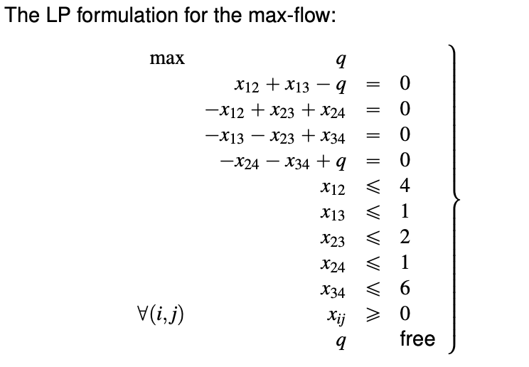

# Network flow

Given a directed network $G = (V,E)$ and a source node $s$, a sink node $t$, and a possibly infinite capacity $u_{ij}$ for each arc $(i,j)$

The max-flow problem is the problem of finding a value of flow for every arc in such a way that

- Flows are nonnegative and arc capacities are satisified
- For every node that is not $s$ or $t$, the incoming flow is equal to the outgoing flow.
- The flow entering the sink $t$ is maximum.

Formulation of the Linear Program

$$
\begin{align}

\text{Objective function}\\

\max& \ q \\

\text{The inflow of the source}\\

  & \qquad \sum_{(s,j) \in E} x_{sj} &=& \ q\\

\text{The outflow of the tap}\\

  & \qquad \sum_{(i,t) \in E} x_{it} &=& \ q\\

\text{For all other nodes, inflow equals outflow}\\

\forall v \in V, v \neq s, t &
  \qquad \sum_{(v,j) \in E} x_{vj} 
       - \sum_{(i,v) \in E} x_{iv} &=& \ 0\\

\text{Capacity constraint}\\

\forall (i,j) \in E&
  \qquad x_{ij} &\leq& \ u_{ij}\\

\text{Nonnegativity constraint}\\

\forall (i,j) \in E&
  \qquad x_{ij} &\geq& \ 0
\end{align}
$$

**Transforming into a max-flow problem**

- Edge with infinite flow - use a very large number as capacity for computation.
- Multiple source - create a single dummy source that has a directed edge to each of the original source. The capacity of the edge is the capacity of the original source. The original source is now like any other node.
- Multiple taps - create a single dummy tap that has a directed node from each of the original tap. The capacity of the edge is the capacity of the original tap. The original tap is now like any other node.

**Ford-Fulkerson algorithm**

Initialise the current flow value as zero.

- Find any directed path $P$ from the source to the tap. 
- Send the maximum possible flow $f$ along $P$.
- Add $f$ to the current flow value.
- Update the path $P$.
  - Decrease the forward capacity by $f$.
  - Increase the backward capacity by $f$
    - You may need to create an (augmenting) path.
  - If a directed edge from the source is zero, remove.
  - If a directed edge to the tap is zero, remove.

Terminate the algorithm when there are no more directed path from the source to the tap. The complexity of the algorithm depends on the choice of augmenting paths.

Add $n$ to the current flow value and update the path. The backflow capacity needs to be decreased if used (from 10 to 9 in the example below). 

My understanding of the intuition
- when you assign the flow you also assign flexibility with the backflow values
- progress is made when the edges from the source and tap is removed, eventually leaving no directed node from the source to the tap

**Primal and dual pair for max-flow problem**

Please analyse.