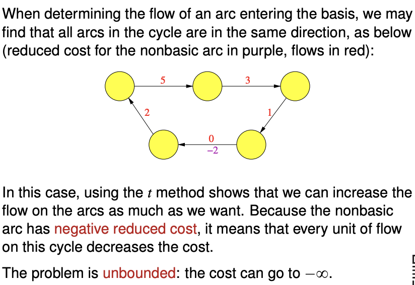
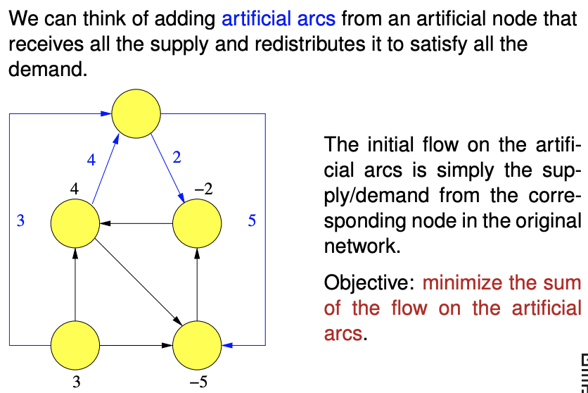

#Min-cost

A tree is a graph **with no cycles**. It can be directed or undirected, but we consider undirected trees.

A spanning tree of a connected graph is a subset of its arcs that forms an undirected tree touching every node. (Directions does not matter here)

The basic feasible solution of the LP formulation of a min-cost flow problem correspond to a spanning tree.

The **basic feasible solution** is a spanning tree that allows all supplies or demands to be satisfied.

The capacity limits $u_{ij}$ will not be considered in this course.

## The algorithm

These are the numbers that you need to keep track of

- Each nodes has
  - Label. This is how the node is referred to.
  - Supply (positive) or demand (negative)
  - Simplex multiplier $y_i$
- Each edge has
  - Capacity - ignored for this course
  - Current flow
    - If the current flow is zero, it is a nonbasic arc
    - If the current flow is positive, it is a basic arc
    - Flow cannot be negative
  - Initial cost $c_{ij}$
  - Reduced cost $\bar{c}_{ij}$
    - The reduced cost of every nonbasic arc is calculated
    - $\bar{c}_{ij} = c_{ij}- y_i + y_j$
    - Initial cost minus decrease in simplex multiplier down the edge

**Initialising the network simplex**

You start with a **basic feasible solution** a minimum spanning tree that allows all supplies and demand to be satisfied.

Compute the **simplex multipliers** starting from a leaf (chosen at random or instructed). The leaf (which is a node) is set to zero. (Arrow points towards a lower value simplex multiplier).

**Recurse until solution is optimal**

Compute the **reduced costs**. If all reduced cost are negative, the solution is optimal.

**Pivot** to improve the BFS. "We try to send as much flow as possible along that arc, while staying feasible". In other words, you redirect the flow to the nonbasic arc, from the (series of) basic arcs, until one of the flow of the basic arc is zero.

**Update the simplex multipliers.** Following is a fast procedure for updating simplex multipliers. Then, repeat the cycle.

**Assumptions**

- The problem is feasible - it is if you can find a basic feasible solution
- No capacity constraints for the edges
  (the exam will not have constrains for edge capacity)
  How it is modified - set the nonbasic variables to either the upper or lower bound. Pivot on this edge only if the reduced cost is negative if the nonbasic variable is at the lower bound, or the reduced cost is positive if the nonbasic variable is at the upper bound.
- Solution is not unbounded.

**Phase I of network simplex**

Do this to obtain a basic feasible solution for the network simplex.

**Miscellaneous**

Simplex stops when it reaches dual feasibility.

Meaning of basic and nonbasic variables - set the nonbasic variables to zero and you get a solution.

The reduced cost is the rate at which the objective value changes with respect to the value.

Why do it this way instead of tableau? The tree structure is more computationally efficient.

**Comparison between simplex and network simplex**

