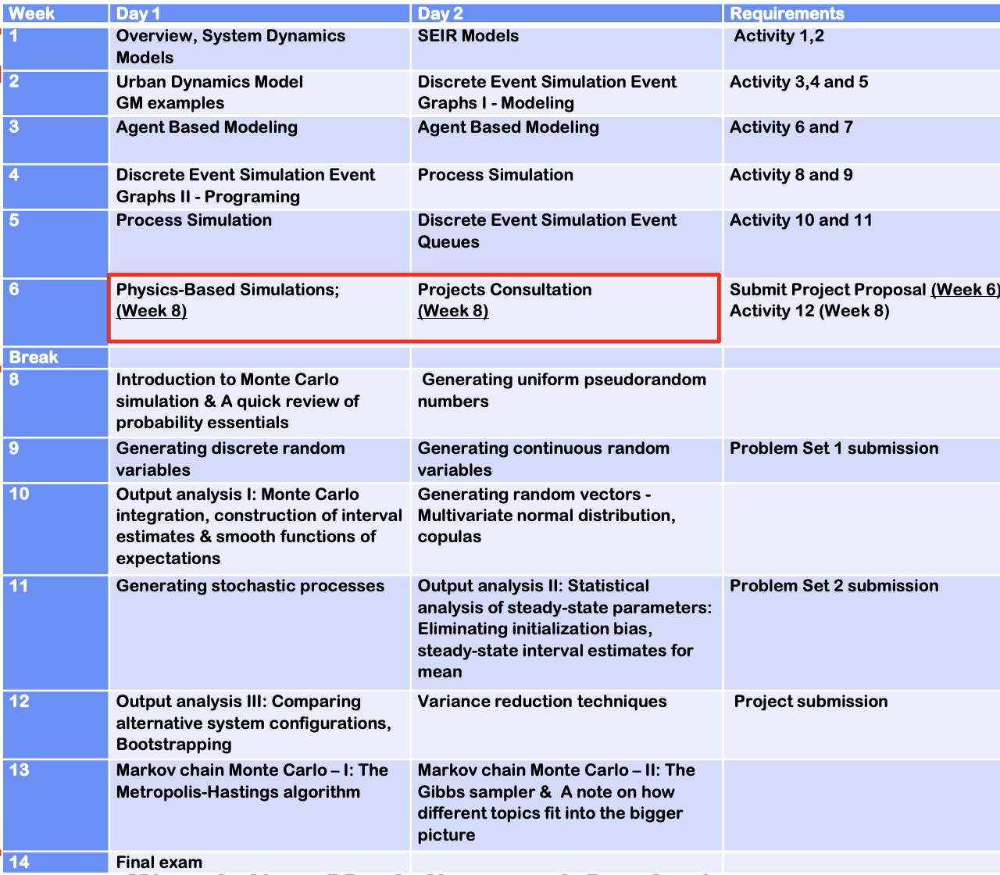

# Simulation Modelling and Analysis

Instructors: (to be added)

## Class Timetable

Monday 9am to 11am
Monday 5pm to 6pm
Wednesday 9am to 11am

| Day       | Mode    | Time        | Remarks    |
| --------- | ------- | ----------- | ---------- |
| Monday    | lecture | 9am to 11am | not cohort |
| Monday    | lecture | 5pm to 6pm  |            |
| Wednesday | lecture | 9am to 11am |            |

## Course timetable

No mid-terms
Week 8 in consultation

## Grading Breakdown

| Grading Component               | Weight (%) |
| ------------------------------- | ---------- |
| Assignments: Modeling Portion   | 15         |
| Project (Week 12)               | 35         |
| Assignments: Analysis Portion   | 10         |
| In-class Quiz (Week 11, likely) | 15         |
| Final Exam (Week 14)            | 25         |

No mid-term exam, some lesson during that time instead.

In the final exam - one or two problems will be from part I - on event graph simulation.

Tutorials and Assignments (15%) 

- Online submission of completed tutorials and activities (10%) 
- Project proposal – due in week 6 (3%) 
- Course feedback survey (2%) 

Project (35%) 

- Develop depth in one methodology (system dynamics, discrete event simulation/ process simulation, agent-based modeling) using a project
- Due in week 12
- Team-based: 1 to 4-person teams of your choosing
- Flexible grading: negotiate score weights with instructor

## Project Guidelines

Default score is 8/10 for each component.

You are only allowed to spend 20 hours in the project, which will be allocated and recorded into the respective sections in the project.

Your grade will be weighted accordingly.

Idea sources

- Go to InsightMaker and Netlogo websites to get ideas for your projects 
- Collect your own data on real-life queues, then simulate and explore alternatives (queues in a supermarket, canteen, airport check-in, etc.) 
- Mimic models you find on the web: aircraft passenger loading, ride-sharing, elevators, … 
- Create traffic simulations 
- Develop an agent-based model to examine emerging agents behavior in determining housing prices - Project to StreetSine 
- Find an industrial client who needs analytical help 
- Compete in Simio extracurricular competition

