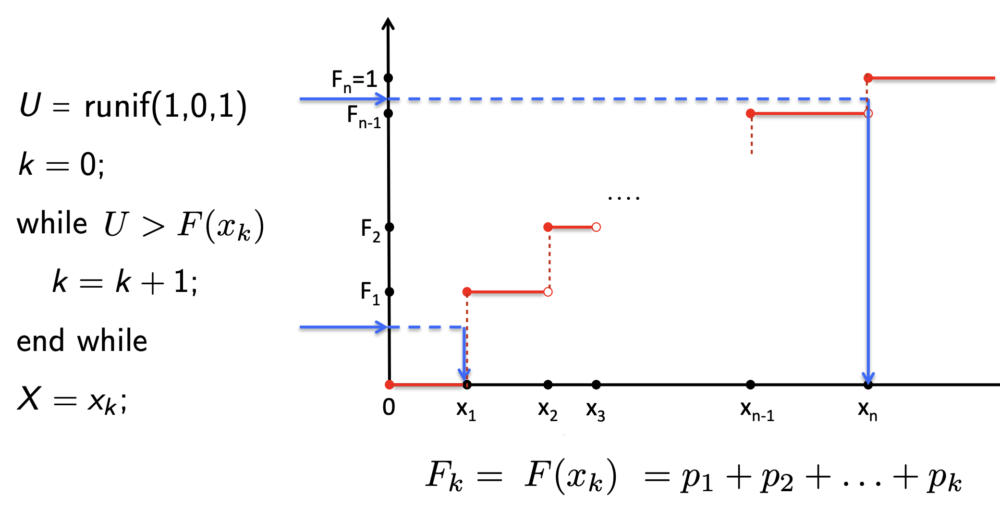
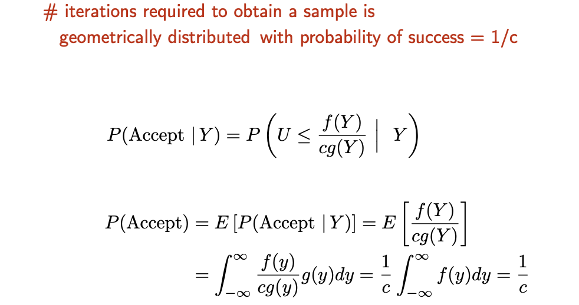
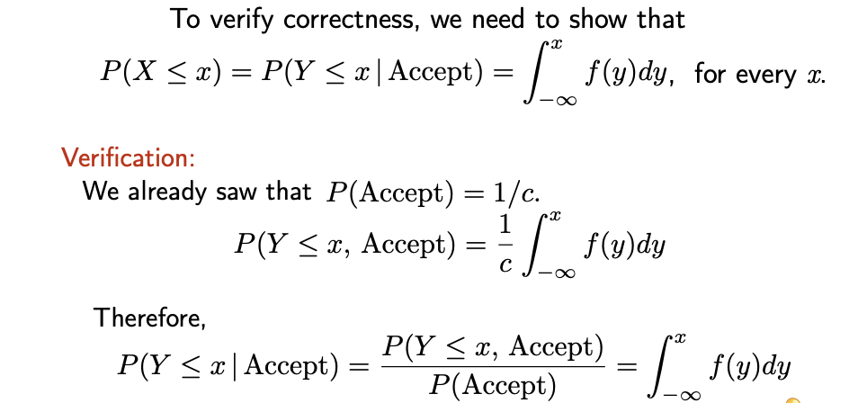

#  Simuation Analysis

A careful simulation model will have to consider many **uncertain** variables 
- such as future demand, labour force available, effect of competition, wages, prices, etc.

Question 1: How do you simulate realizations of various random variables which model uncertainty (specifically and realistically)?

Question 2: How do you "make sense" of the simulation output affected by randomness?
- How do you remove initialization bias (eg: bias due to starting factory "empty and idle")
- How long do you run simulation to get desired accuracy?
- How long do you run simulation to firmly establish that one system configuration is better than other?

Given the probability distribution (**PDF**, **PMF**, **CDF**) of a random variable $X$, how to do you generate samples of $X$ with random uniform variable $U$?

$U \sim \text{Uniform}[0,1] $ 

## Inverse transform method

Given the PDF or CDF or a random variable, define a method to generate the random variable. Following are the steps for a **continouous random variable**.

**Obtaining the CDF $F(x)$ from the PDF $f(x)$**
$$
\text{F}(v) = \int_{-\infty}^v \text{f}(x) \enspace dx
$$

If the PDF is **defined piecewise**, the CDF needs to be defined piecewise as well. The constant of integration for each piece is one that such that the limits of each piece match each other.

Please be reminded that the CDF is an increasing function (in other words, strictly non-decreasing).

You need to know how to **integrate a function** and **fix the constant of integration**.

**Inverting a continuous CDF**

To obtain the random variable generating function **(Inverse transform method)**

Take the inverse function of CDF (i.e. express the variable $x$ in terms of the CDF). You can generate samples of $X$ with the required probability distribution with the inverse CDF function $F^{-1}(x)$, with the random uniform variable as an input.
$$
\begin{align}
u = F(x)      &= 1 - exp(-x/\mu)\\
F^{-1}(x) &= -\mu \ln(1-u)
\end{align}
$$

Therefore $X = F^{-1}(x) = -\mu \ln(1-U)$  is exponentially distributed with mean $\mu$.

If the CDF is **defined piecewise**, the inverse function is defined piecewise too (the range is now the domain). Pieces outside $[0,1)$ can be ignored, due to the range of $U$, an example is $F^{-1}(x) = x^{1/3}$ from $f(x) = 3x^2$.

You need to know how to **invert a function** (example: triangular function - you need to be able to complete the square).

Following are the steps for a **discrete random variable**.

**Obtaining the CDF from the PMF**

We are now handling discrete random variables.

$$
P(X = x_k) = p_k \quad \text{for } k = 1, 2, ... , n
$$

The CDF of the PMF is

$$
F(x_k) = P(X \leq x_k) = p_1 + ... + p_k
$$

Please take note of the closed and open endpoints of each segment.

**Inverting a discontinuous CDF**

Consider the general definition of inverse

$$
F^{-1}(u) = \min\{x:F(x)\geq u \}
$$

The inverse is the minimum value of the function. Following is an example with the geometric distribution.

$$
\begin{align}
F^{-1}(x) 
&= \min\{x:F(x) \geq u\} \\
&= \min\{x: 1-(1-p)^{\lfloor x \rfloor} \geq u\} \\
&= \min\{x: (1-p)^{\lfloor x \rfloor} \geq 1-u\} \\
&= \min\{x: {\lfloor x \rfloor} \log(1-p) \geq 1-u\} \\
&= \min\{x: {\lfloor x \rfloor} \leq \frac{\log(1-u)}
{\log(1-p)} \}
\end{align}
$$

Please note that the **inequality is flipped** as $\log(1-p)$ is always negative.

## Acceptance/Rejection method

Introductory examples 

- triangle distribution and uniform distribution within in a circle

Objective: to obtain sample from a target PDF $f(x)$.

**Preparation**

You need a pdf $g(x)$ and an constant $c$. Conditions

- You are able to generate a sample of random variable $Y$ from pdf $g(x)$
(note that the **area under curve of a pdf is one**)
- There needs to be a $c$ such that $f(x) \leq c \cdot g(x)$
  (note that $c$ is necessarily $\geq 1$)

**How to obtain a samples** (will test in exam)

Step 1) Obtain sample $Y$ from the pdf $g$

Step 2) Obtain an independent sample $U$ from the uniform distribution.

Step 3) If $U \leq \frac{f(Y)}{(c \cdot g(Y))}$ then set $X = Y$ accept, or else reject and restart this procedure.

**Number of computations**

Therefore $c$ characterises the efficiency of the method - we want to use as small a $c$ as possible.

**Proof of correctness**

**Common types of g(x)**

- Uniform distribution
  If it is assumed that an machine can give this variable without problem.
- Exponential distribution
  $e^{-|x|}$ for $x > 0$, and $0$ for other $x$
  
  $\frac{1}{2}e^{-|x|}$ for all $x$

## Generation of random uniform variables

Linear congruential generators

$x_n = a x_{n-1} + c \mod m$

Ideally $m$ is a large prime number, and $a$ is a number between $1$ and $m-1$. So after a finite number (at most m) the generated values are repeated. For large prime number $m$ it takes a huge amount of time to repeat.

