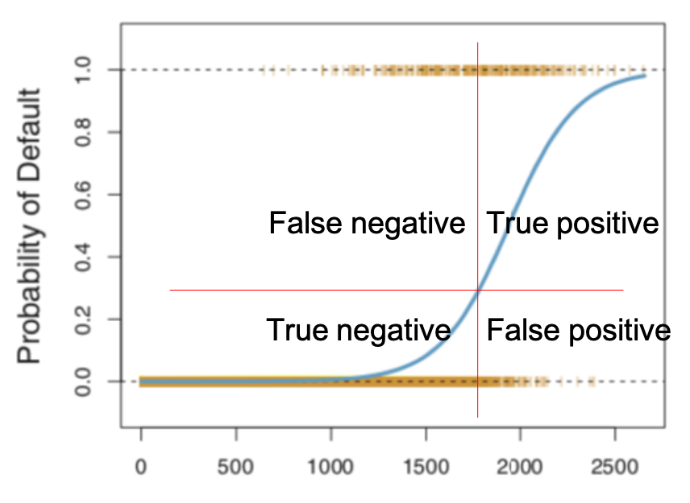

## Introduction

Data, Models, Decisions

Statistics, Optimisation, Simulation

Descriptive - What happened?
Predictive - What would happen?
Prescriptive - What should we do?

Interpretability of the model is sometimes important. Trade-off between interpretability and performance.

Precision and accuracy


**Example given**. Watson in Jeopardy

- Pipeline to answer the question. 
  - Processing of the question
  - Searching the database
  - Formulating an answer

- Strategy involved in the game
  - Whether to buzz in
  - How much to wager (depends on opponents' pool)


Initial comments on the course

- Feels a bit confused. Added too many things together.
  - NLP, Kaggle
  - R and Julia


## Installation of R packages

How to install R packages on MacOS with Xcode installed. Assume that you have R install, probably with `brew install R`

```bash
xcode-select --install
```

Do some magic https://github.com/frida/frida/issues/338

```bash
cd /Library/Developer/CommandLineTools/Packages/
open macOS_SDK_headers_for_macOS_10.14.pkg
```

Open the R code with root permissions

```bash
sudo R
```

(to confirm, do you need sudo R?)

Then on R console install the packages.

```R
install.packages("ggplot2")
install.packages("psych")
install.packages("ggfortify")
install.packages("ROCR")
```


# Confusion matrices


Names  | Predict = 0 | Predict = 1 
--------------- | ------------------- | ------------------- 
**Actual = 1** | False Negative (FN) | True Positive (TP)  
**Actual = 0** | True Negative (TN)  | False Positive (FP) 





 Name                  | Alt Name             | Formula                           
 --------------------- | -------------------- | --------------------------------- 
 False Positive Rate   | Type I error         | $\frac{FP}{FP+TN}$                
 True Negative Rate    | Specificity          | $\frac{TN}{FP+TN}$                
 True Positive Rate    | Sensitivity, Recall  | $\frac{TP}{TP+FN}$                
 False Negative Rate   | Type II error        | $\frac{FN}{TP+FN}$                
 Precision             |                      | $\frac{TP}{TP + FP}$              
 **Compiled measures** |                      |                                   
 Overall Accuracy      |                      | $\frac{TP+TN}{FP + FN + TP + TN}$ 
 F1 Score              |                      |                                   
 ROC Curve             | Plot TPR against FPR |                                   


# Overview of lessons

**Week 2**

Method     | Linear Regression
---------- | ----------------------------------------------------- 
Target     | Number
Model | $$y_i = \beta_0 + \beta_1 x_1 + \beta_2 x_2 + ... + \epsilon_i $$ 
Loss | Mean square error 
Quality of fit | R-square<br />Adjusted R-square<br />AIC 
Prediction | Wine prices and quality<br />Baseball batting average 
Comments | Choose only the statistically significant variables<br />This cannot predict binary objectives. 


**Week 3**

Method     | Logistic Regression
---------- | ----------------------------------------------------- 
Target        | Binary, probability 
Model | $$P(y_i = 1) = \dfrac{1}{1+e^{-(\beta_0 + \beta_1 x_1 + \beta_2 x_2 + ...+ \epsilon_i )}}$$ 
Loss | $$LL(\beta) \\ = \displaystyle \sum_{i=1}^n \sum_{k=1}^2 y_{ik} \log \left( P(y_{ik} = 1) \right)\\= \displaystyle \sum_{i=1}^n \sum_{k=1}^2 y_{ik} \log \left( \frac{e^{\beta' x_i}} {e^{1+\beta' x_i}} \right) $$ 
Explanation | x log x', sum for x=1 and x=0 (elaborate) 
Quality of fit | $$AIC = -2LL(\hat{\beta}) + 2(p+1)$$<br />Confusion matrix<br />AUC-ROC 
Prediction | Space shuttle failures<br />Risk of heart disease 
Comment |  


**Week 4a**

Method     | Multinomial Logit     
---------- | ----------------------------------------------------- 
Target        | n-choose-1, probabilities that sum to one 
 Model | $$P(y_{ik} = 1 | \{ \text{options} \}) = \dfrac{e^{\beta' x_{ik}}} {\sum_{l=1}^k e^{\beta' x_{il}}}$$ 
 Loss | $$LL(\beta) \\ = \displaystyle \sum_{i=1}^n \sum_{k=1}^K z_{ik} \log(P(y_{ik} = 1)) \\ = \displaystyle \sum_{i=1}^n \sum_{k=1}^K z_{ik} \log \dfrac{e^{\beta' x_{ik}}} {\sum_{l=1}^k e^{\beta' x_{il}}}$$ 
 Explanation | $z_{ik}$ is the training option from the dataset which is binary.<br />$x_{ik}$ is the characteristic of one training option considered. ($x_{il}$ is similar, but it includes the rest of the training option included in the choice).<br />You are tasked to provide $\beta'$ that maximises the log-likelihood.<br />The probability that option $k$ is chosen from a set of choices is $P(y_{ik} = 1)$, and this is a real number. 
 Quality of fit | Confusion matrix<br />AIC<br />Likelihood ratio index $$1-\frac{LL(\beta)}{LL(0)}$$ 
Prediction | Academy Award winners 
Comment | **Independence of Irrelevant Alternatives** - adding in a third alternative does not change the ratio of probabilities of two existing choxwices. (Probably it still does affect the training process?) 


**Week 4b**

Method     | Mixed Logit                   
---------- | ----------------------------------------------------- 
Target        | n-choose-1, probabilities that sum to one 
Model | $$P(y_{ik} = 1 | \{ \text{options} \}) = ???$$ 
Loss | 
Quality of fit | 
Prediction | Preference of safety features 
Comment | The data structure of the Academy Award is different from the safety feature options. (elaborate)<br />You can also evaluate how much people will pay for a certain extra feature, without directly getting their evaluation. (explore) 


